# Syzkaller


## 架构和使用

Syzkaller是google安全研究人员开发并维护的内核fuzz工具，由go语言编写，含少部分c/c++代码。支持多个操作系统内核，如linux、windows、darwin、openbsd等等，其对linux的支持最为全面。


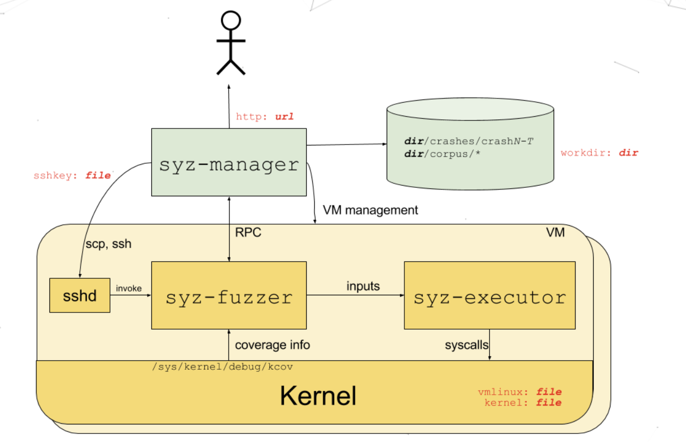

Syzkaller由多个部件组成：

+ syz-manager 总管中枢：管理整个模糊测试，启动/停止虚拟机，收集 crash和coverage数据，提供 Web UI 展示测试进展和崩溃详情
  + 解析配置文件json格式
  + 启动多个VM实例并通过SSH部署`syz-fuzzer`，
  + 收集VM回传的crash信息，保存日志、生成 repro（复现程序）
  + 自动保存工作状态到`workdir`目录，可断点续测
+ syz-fuzzer 模糊测试引擎：在每个VM内执行，负责生成syscall程序，把生成的程序传给executor执行
+ syz-executor syscall执行器： 在内核中运行syscall程序，收集执行的覆盖率数据，监控是否触发了异常


执行过程如下：

1. 启动syz-manager：执行`./bin/syz-manager -config=config.json`，其中config.json定义了配置(也可以是cfg格式)
2. 启动虚拟机：syz-manager会启动一组VM实例，模拟被检测环境
3. 启动 syz-fuzzer 子进程：syz-manager为每个VM实例启动一个syz-fuzzer子进程，负责生成 syscall fuzz 程序，并通过 RPC 控制 VM 中的执行器。
4. 建立SSH连接：使用SSH登录VM，并把fuzzing所需的syz-executor上传进去
5. 开始模糊测试：虚拟机中运行syz-executor，根据从宿主机 `syz-manager` 下发的 syscall 程序和参数，不断调用各种系统调用
6.  Bug 反馈和处理：如果触发了崩溃（比如内核 oops/panic），会通过日志、符号解析工具等分析出崩溃点，崩溃信息会通过RPC反馈给syz-manager


syz-manager通过ssh调用syz-fuzzer，syz-fuzzer和syz-manager之间通过RPC进行通信。syz-fuzzer将输入传给syz-executor，从kernel中读取代码覆盖率信息。syz-executor执行syscall系统调用。


SSH（Secure shell）是一种安全的远程登陆协议，用于通过网络安全地访问另一台计算机终端，在Syzkaller 中，SSH用于和被测虚拟机进行通信

## 安装过程

选择环境**VMware+Ubuntu** ，[官方文档](https://github.com/google/syzkaller/blob/master/docs/linux/setup_ubuntu-host_qemu-vm_x86-64-kernel.md)

### 前置

下载go语言编译器，版本需要\>= 1.16 

```shell
wget https://dl.google.com/go/go1.22.3.linux-amd64.tar.gz
tar -xf go1.22.3.linux-amd64.tar.gz
mv go go1.22.3

# 设置环境变量
echo 'export GOROOT=$HOME/run1/go1.22.3' >> ~/.bashrc
echo 'export PATH=$GOROOT/bin:$PATH' >> ~/.bashrc
# 生效
source ~/.bashrc
# 检查是否安装成功
go version
```


下载编译syzkaller

```shell
git clone https://github.com/google/syzkaller
cd syzkaller
make
```


下载编译linux内核，**进行浅克隆**，只获取最新提交，不包含各种提交历史，这样可以拉取更快且节省空间(~200MB)

```shell
git clone --depth=1 --branch v6.6 https://git.kernel.org/pub/scm/linux/kernel/git/torvalds/linux.git linux-6.6
```

生成默认配置

```shell
cd linux-6.6
make defconfig
make kvm_guest.config
```

启用 Syzkaller 所需内核配置，即手动修改.config文件中以下项——`nano .config`

```shell
CONFIG_KCOV=y                    # 代码覆盖追踪（coverage）
CONFIG_DEBUG_INFO_DWARF4=y      # 含符号调试信息（用于 crash 定位）
CONFIG_KASAN=y                  # 内存访问错误检测器
CONFIG_KASAN_INLINE=y           # KASAN 内联（性能更好）
CONFIG_CONFIGFS_FS=y            # Debian Stretch 及以上所需
CONFIG_SECURITYFS=y             # Debian 系统安全相关功能
```

再次更新

```shell
make olddefconfig
```

编译内核

```shell
make -j$(nproc)
```

注意这里版本不能太低，否则执行make指令会出现下述错误，选择linux6.6不会出现问题

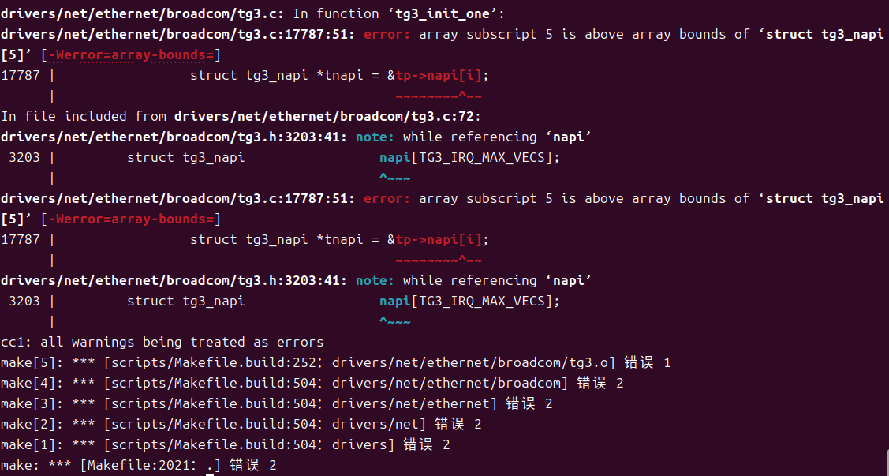

执行下述指令验证**内核是否编译成功**

```shell
ls linux-6.6/vmlinux
ls linux-6.6/arch/x86/boot/bzImage
```


### 系统镜像

创建适用于QEMU的Debian系统镜像，用于内核模糊测试

```shell
# 创建镜像目录
mkdir ~/run1/stretch-img
cd ~/run1/stretch-img

# 下载官方脚本
wget https://raw.githubusercontent.com/google/syzkaller/master/tools/create-image.sh -O create-image.sh

# 赋予执行权限
chmod +x create-image.sh

# 运行脚本，构建镜像
./create-image.sh --feature full
```

注意不能直接写./create-image.sh，否则会默认安装最小系统，会缺失一些功能


查看结构

```shell
tree -L 1 stretch-img
```

```python
stretch-img
├── bullseye
├── bullseye.id_rsa
├── bullseye.id_rsa.pub
├── bullseye.img
└── create-image.sh
```


配置网络接口并启动SSH服务，设置rc.local

```shell
sudo mkdir -p /mnt/vm
sudo mount -o loop /home/ming/run/stretch-img/bullseye.img /mnt/vm
cd /mnt/vm
sudo nano etc/rc.local

cd ..
sudo umount /mnt/vm
```

填入

```shell
#!/bin/sh -e

# 使用 logger 输出信息到系统日志
logger "Running /etc/rc.local"

ip link set eth0 up
ip addr flush dev eth0
ip addr add 10.0.2.15/24 dev eth0
ip route add default via 10.0.2.2

# 启动 SSH 服务
logger "Starting SSH service..."
/etc/init.d/ssh start

# 输出结束
logger "rc.local execution finished."

exit 0
```


### QEMU

安装QEMU虚拟机，Syzkaller默认使用QEMU启动虚拟机运行内核进行模糊测试

```shell
sudo apt install qemu-system-x86
```


测试虚拟机

```shell
qemu-system-x86_64 \
  -m 2G \
  -smp 2 \
  -kernel /home/ming/run/linux-6.6/arch/x86/boot/bzImage \
  -append "console=ttyS0 root=/dev/sda earlyprintk=serial net.ifnames=0" \
  -drive file=/home/ming/run/stretch-img/bullseye.img,format=raw \
  -net user,host=10.0.2.10,hostfwd=tcp:127.0.0.1:10021-:22 \
  -net nic,model=e1000 \
  -enable-kvm \
  -nographic \
  -pidfile /home/ming/run/vm.pid \
  2>&1 | tee /home/ming/run/vm.log
```

配置中kernel和drive file要替换为自己的镜像路径，enable-kvm需要虚拟机VMware启动虚拟化

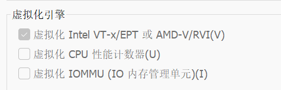

启动成功会出现，默认的账号是root，密码回车即可

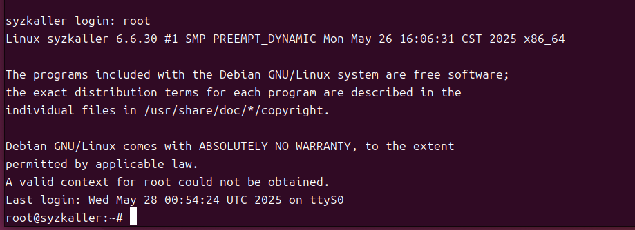


测试ssh连接

```shell
ssh -i ~/run/stretch-img/bullseye.id_rsa -p 10021 root@127.0.0.1
```


成功应出现，输出exit即可退出

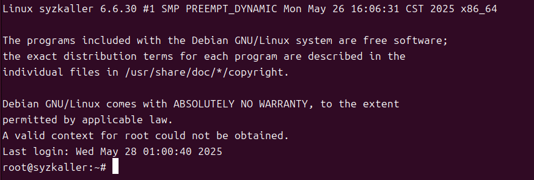


### 启动Syzakller

启动syzkaller(在syzkaller目录下)

```shell
./bin/syz-manager -config=my.cfg -debug
```


my.cfg指定了syzkaller的配置，使用默认配置替换下路径即可

```json
{
    "target": "linux/amd64",
    "http": "127.0.0.1:56741",
    "workdir": "/home/ming/run/syzkaller/workdir",
    "kernel_obj": "/home/ming/run/linux-6.6",
    "image": "/home/ming/run/stretch-img/bullseye.img",
    "sshkey": "/home/ming/run/stretch-img/bullseye.id_rsa",
    "syzkaller": "/home/ming/run/syzkaller",
    "procs": 8,
    "type": "qemu",
    "vm": {
        "count": 4,
        "kernel": "/home/ming/run/linux-6.6/arch/x86/boot/bzImage",
        "cpu": 2,
        "mem": 2048
    }
}
```


注意同一时间syzkaller不能和单独的qemu同时执行否则会出现，关闭其中一个即可

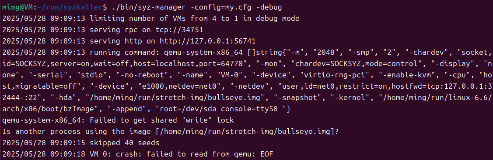


在执行过程中出现以下错误

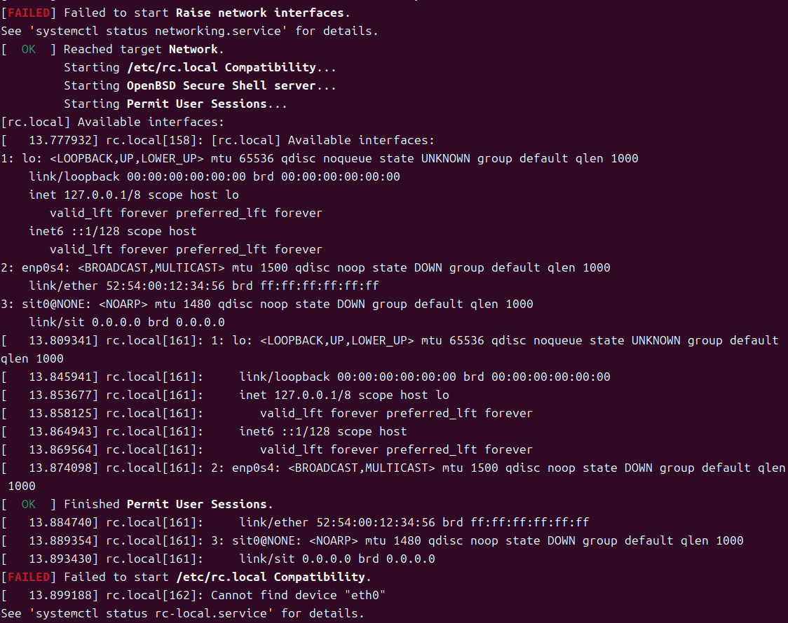

似乎是因为虚拟网卡的问题，经过测试发现，单独的qemu启动使用的是eht0，而syzkaller启动的qemu使用的是enp0s4，不同的机器可能有不同的配置，可以在rc.local添加命令打印出syzkaller所用的网卡

```shell
echo "[rc.local] Available interfaces:" | tee /dev/console
ip a | tee /dev/console
```

然后根据输出对照地设置


目前已知syzkaller使用的是enp0s4，因此更改rc.local以及/etc/network/interfaces

其中rc.local

```shell
sudo mkdir -p /mnt/vm
sudo mount -o loop /home/ming/run/stretch-img/bullseye.img /mnt/vm
cd /mnt/vm
sudo nano etc/rc.local

cd ..
sudo umount /mnt/vm
```

填入，其实只要修改eht0为enp0s4即可

```shell
#!/bin/sh -e

# 使用 logger 输出信息到系统日志
logger "Running /etc/rc.local"

echo "[rc.local] Available interfaces:" | tee /dev/console
ip a | tee /dev/console

ip link set enp0s4 up
ip addr flush dev enp0s4
ip addr add 10.0.2.15/24 dev enp0s4
ip route add default via 10.0.2.2

# 启动 SSH 服务
logger "Starting SSH service..."
/etc/init.d/ssh start

# 输出结束
logger "rc.local execution finished."

exit 0
```


/etc/network/interfaces

```shell
sudo mkdir -p /mnt/bullseye
sudo mount -o loop /home/ming/run/stretch-img/bullseye.img /mnt/bullseye
sudo nano /mnt/bullseye/etc/network/interfaces
sudo umount /mnt/bullseye
```

填入

```shell
source /etc/network/interfaces.d/*

auto enp0s4
iface enp0s4 inet static
    address 10.0.2.15
    netmask 255.255.255.0
    gateway 10.0.2.2
```


完成后再次执行

```python
./bin/syz-manager -config=my.cfg -debug
```

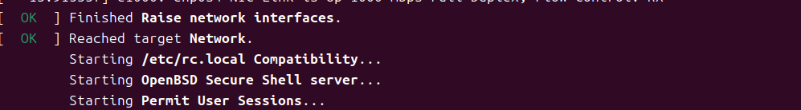


打开http://127.0.0.1:56741/，syzkaller提供的UI界面，可以看到已经成功在执行模糊测试了

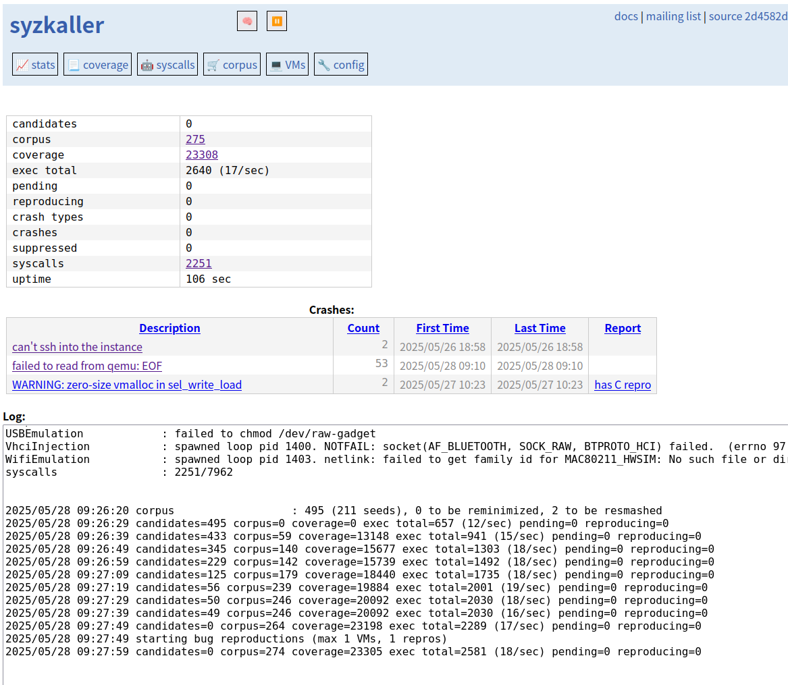


## Syzlang语法

Syzlang是Syzkaller使用的**接口定义语言**，用于描述**Linux系统调用的参数规格**，Syzkaller根据这些定义自动生成fuzz输入。


### 参数类型

| 类型     | 示例                           | 含义                                                         |
| -------- | ------------------------------ | ------------------------------------------------------------ |
| intN     | int32[0:1000，4]               | N位整数，指定了0到100(大括号是**闭区间**)且必须是4的倍数     |
| ptr      | ptr[in,XXX]                    | 指针(**in只读/out只写/inout读写**)，例子表示的是一个指向XXX的只读指针 |
| array    | array[int32]/ array[int32,5]   | 可变或固定长度**数组**                                       |
| flags    | flags[flagname,int32]          | 标志集合                                                     |
| string   | string['foo']/string[filename] | 字符串或文件名，结合ptr[in, string["/dev/null"]]传入指向字符串的输入指针 |
| const    | const[值 , 类型]               | **常量值**                                                   |
| len      | len[buf]                       | 某个字段的长度，**动态关联**                                 |
| proc     | proc[20000,4,int16be]          | 进程特有的值                                                 |
| resource | resource fd[int32]             | **定义**一种资源类型，名称是fd，底层是int32                  |
| struct   | ...                            | 结构体，包含多个字段                                         |


结构体

```python
my_struct {
    field0 const[1, int32] (in)
    field1 int32 (inout)
    field2 fd (out)
}
```

+ field0一个用于写入的常量
+ field1 可被修改的整数值
+ field2 输出字段

结构体作为参数使用**指针**传递

```python
some_syscall(arg ptr[inout, my_struct])
```


union表示**多选一**的字段结构，如果没有条件判断，**默认**的就是**随机选择**，字段之间不需要加**逗号**。

```python
command {
  cmd_id int32
  payload [
    foo int32 (if[value[cmd_id] == 1])
    bar array[int8, 4] (if[value[cmd_id] == 2])
    baz int64
  ] [varlen]
} [packed]
```


### 类型别名

```python
type signalno int32[0:65]
type buffer[DIR] ptr[DIR, array[int8]]
```

和C一样


### 基本结构

系统调用的基本结构如下

```
syscallname(arg1 type1,arg2 type2) return_type (attr1,attr2)
```

+ **syscallname：系统调用名**
+ **arg，type：参数名称与类型**
+ **return_type：返回值类型**
+ **attri：控制调用行为的属性**


```python
write(fd fd, buf ptr[in, array[int8]], count len[buf])
```

+ fd是一个资源，其类型fd是预定义的resource fd[int32]，用于表示文件
+ buf是一个执行int8类型的数组的指针
+ count是表示buf长度的变量，会自动同步

相当于

```python
ssize_t write(int fd, const void *buf, size_t count);
```


### 调用属性

| 属性名            | 含义                                                         |
| ----------------- | ------------------------------------------------------------ |
| `disabled`        | **禁用**该 syscall，不生成测试用例（但保留定义）             |
| `timeout[N]`      | **增加**该 syscall 的**单独执行超时时间**（毫秒）            |
| `prog_timeout[N]` | 如果程序包含此 syscall，整个程序的执行时间将增加 N 毫秒      |
| `ignore_return`   | 忽略该 syscall 的返回值，不用它参与反馈机制（常用于时间、随机数等） |
| `breaks_returns`  | 执行此调用后，**忽略所有后续调用的返回值**（返回值不可被信任） |
| `no_generate`     | 不自动生成该 syscall，只使用种子程序中的它（适用于只读分析） |
| `no_minimize`     | 不对该 syscall 进行最小化（保持其原始调用参数）              |
| `fsck`            | 针对压缩文件系统的检查调用，结合 `compressed_image` 使用     |
| `remote_cover`    | 调用执行完后等得更久一点，用于收集远程 coverage（适用于嵌套 RPC 等） |


```python
reboot(magic const[0xfee1dead, int32]) int32 (disabled)
```

禁用reboot


```python
mount(src ptr[in, string], ...) int32 (timeout[5000])
```

增加时限防止误杀


### 条件字段

```python
field type (if[value[路径] == 常量])
```

其中**value[X]**表示取字段的值，判断条件用**()**包裹，if的条件用**[]**包裹


## 调试过程


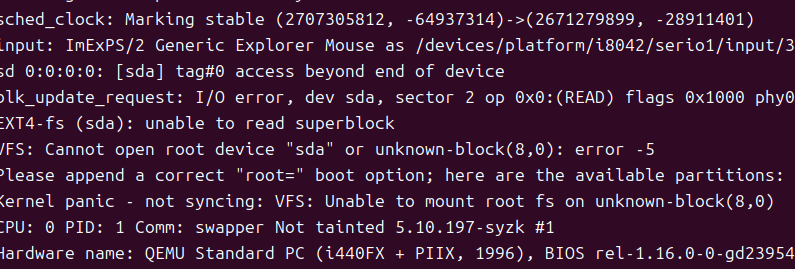


条件字段还包括**嵌套引用**，即

```python
packet {
  header header_struct
  data   array[int8] (if[value[header:has_data] == 1])
}

header_struct {
  magic     const[0x1234, int16]
  has_data  int8
} [packed]
```

表示访问header字段下的has_data字段

在结构体末尾添加**[packed]**，表示结构体是可变的


```python
qemu-system-x86_64   -m 2G   -smp 2   -kernel /home/ming/run/linux-6.6/arch/x86/boot/bzImage   -append "console=ttyS0 root=/dev/sda earlyprintk=serial net.ifnames=0"   -drive file=/home/ming/run/stretch-img/bullseye.img,format=raw   -net user,host=10.0.2.10,hostfwd=tcp:127.0.0.1:10021-:22   -net nic,model=e1000   -enable-kvm   -nographic   -pidfile /home/ming/run/vm.pid   2>&1 | tee /home/ming/run/vm.log


qemu-system-x86_64 \
  -m 2048 \
  -smp 2 \
  -kernel ~/linux-5.10.197/arch/x86/boot/bzImage \
  -append "console=ttyS0 root=/dev/vda rw init=/bin/sh" \
  -drive file=~/syzkaller/stretch.img,format=raw,if=virtio \
  -net user,hostfwd=tcp::10022-:22 \
  -net nic,model=e1000 \
  -nographic

qemu-system-x86_64 \
  -m 2G -smp 2 \
  -kernel /home/ming/linux-5.10.197/arch/x86/boot/bzImage \
  -hda /home/ming/syzkaller/stretch.img \
  -append "root=/dev/sda console=ttyS0 init=/etc/rc.local" \
  -net user,hostfwd=tcp::10022-:22 \
  -net nic,model=e1000 \
  -nographic

```


```python
ps aux | grep qemu-system
```


```python
ssh -i ~/run/stretch-img/bullseye.id_rsa -p 10021 root@127.0.0.1
```

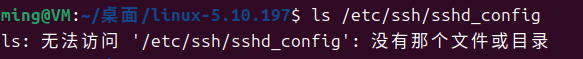


 方法一：将这些命令写成 `/init` 脚本内嵌到镜像中

这是**推荐做法**，syzkaller 官方也是这么干的。

### 📌 步骤如下（仅做一次）：

1. 在宿主机创建并写入 `/init` 脚本到镜像根目录：


JSON

```python
{
	"target": "linux/amd64",
	"http": "127.0.0.1:56741",
	"workdir": "/home/ming/run/syzkaller/workdir",
	"kernel_obj": "/home/ming/run/linux-6.6",
	"image": "/home/ming/run/stretch-img/bullseye.img",
	"sshkey": "/home/ming/run/stretch-img/bullseye.id_rsa",
	"syzkaller": "/home/ming/run/syzkaller",
	"procs": 8,
	"type": "qemu",
	"vm": {
		"count": 4,
		"kernel": "/home/ming/run/linux-6.6/arch/x86/boot/bzImage",
		"cpu": 2,
		"mem": 2048
	}
}

```


/mnt/etc/rc.local

```python
mkdir /tmp/stretch
sudo mount -o loop /home/ming/syzkaller/stretch.img /tmp/stretch
sudo nano /tmp/stretch/etc/rc.local

sudo chmod +x /tmp/stretch/etc/rc.local
sudo umount /tmp/stretch


mkdir /tmp/stretch
sudo mount -o loop /home/ming/syzkaller/stretch.img /tmp/stretch
sudo cat /tmp/stretch/etc/rc.local

sudo chmod +x /tmp/stretch/etc/rc.local
sudo umount /tmp/stretch


# 创建挂载点目录（如果没有）
sudo mkdir -p /mnt/vm

# 挂载镜像文件到 /mnt/vm
sudo mount -o loop /home/ming/run/stretch-img/bullseye.img /mnt/vm
cd /mnt/vm
# 做修改，比如编辑 rc.local 或者其他文件
sudo nano etc/rc.local

cd ..
sudo umount /mnt/vm

```


```python
ps aux | grep sshd
/usr/sbin/sshd -D -e
```


```python
#!/bin/sh

echo "[rc.local] starting setup..." > /dev/console

# 必要挂载
mount -t proc none /proc
mount -t sysfs none /sys
mount -t devtmpfs none /dev

# 字符设备（防止 sshd 卡死）
[ -c /dev/null ] || mknod -m 666 /dev/null c 1 3
[ -c /dev/zero ] || mknod -m 666 /dev/zero c 1 5
[ -c /dev/random ] || mknod -m 444 /dev/random c 1 8
[ -c /dev/urandom ] || mknod -m 444 /dev/urandom c 1 9

# 创建主机密钥（如果没有）
[ -f /etc/ssh/ssh_host_rsa_key ] || ssh-keygen -f /etc/ssh/ssh_host_rsa_key -t rsa -N ''
[ -f /etc/ssh/ssh_host_ed25519_key ] || ssh-keygen -f /etc/ssh/ssh_host_ed25519_key -t ed25519 -N ''

# 写一个简化的 sshd 配置
cat > /etc/ssh/sshd_config <<EOF
Port 22
PermitRootLogin yes
PasswordAuthentication no
PermitEmptyPasswords yes
UseDNS no
PermitUserEnvironment yes
PermitTTY yes
PermitOpen any
HostKey /etc/ssh/ssh_host_rsa_key
HostKey /etc/ssh/ssh_host_ed25519_key
EOF

# 启动 sshd，打印输出
echo "[rc.local] launching sshd..." > /dev/console
/usr/sbin/sshd -D &

# 保持系统不退出
echo "[rc.local] ready, opening shell..." > /dev/console
exec /bin/sh


#!/bin/sh

# 重新挂载根目录为可写
mount -o remount,rw /

# 创建并挂载系统需要的目录
mkdir -p /proc /sys /run /dev /dev/pts
mount -t proc proc /proc
mount -t sysfs sys /sys
mount -t tmpfs tmpfs /run
mount -t devtmpfs devtmpfs /dev
mount -t devpts devpts /dev/pts

# 配置网络（QEMU user 网络中 eth0 默认自动连接）
ip link set dev eth0 up
ip addr add 10.0.2.15/24 dev eth0
ip route add default via 10.0.2.2

# 初始化 sshd 环境
mkdir -p /run/sshd /var/run/sshd
ssh-keygen -A

# 确保 sshd 可登录
grep -q '^PermitRootLogin' /etc/ssh/sshd_config || echo "PermitRootLogin yes" >> /etc/ssh/sshd_config
grep -q '^PasswordAuthentication' /etc/ssh/sshd_config || echo "PasswordAuthentication no" >> /etc/ssh/sshd_config
grep -q '^UsePAM' /etc/ssh/sshd_config || echo "UsePAM no" >> /etc/ssh/sshd_config
grep -q '^PubkeyAuthentication' /etc/ssh/sshd_config || echo "PubkeyAuthentication yes" >> /etc/ssh/sshd_config
grep -q '^AuthorizedKeysFile' /etc/ssh/sshd_config || echo "AuthorizedKeysFile .ssh/authorized_keys" >> /etc/ssh/sshd_config
grep -q '^Subsystem sftp' /etc/ssh/sshd_config || echo "Subsystem sftp /usr/lib/openssh/sftp-server" >> /etc/ssh/sshd_config

# 启动 sshd
/usr/sbin/sshd

# 开启反向端口转发，把 VM 的 10000 转发到 Host 的 10000
ssh -i /root/stretch.id_rsa -o StrictHostKeyChecking=no -o UserKnownHostsFile=/dev/null -f -N -R 10000:127.0.0.1:10000 root@10.0.2.2 -p 10022

# 打印提示
echo "[rc.local] SSHD + Port Forwarding Ready"

# 可选：保持 shell 防止退出
exec /bin/sh


ip link set dev eth0 up
ip addr add 10.0.2.15/24 dev eth0
```


./bin/syz-manager -config=my.cfg -debug


http://127.0.0.1:56741


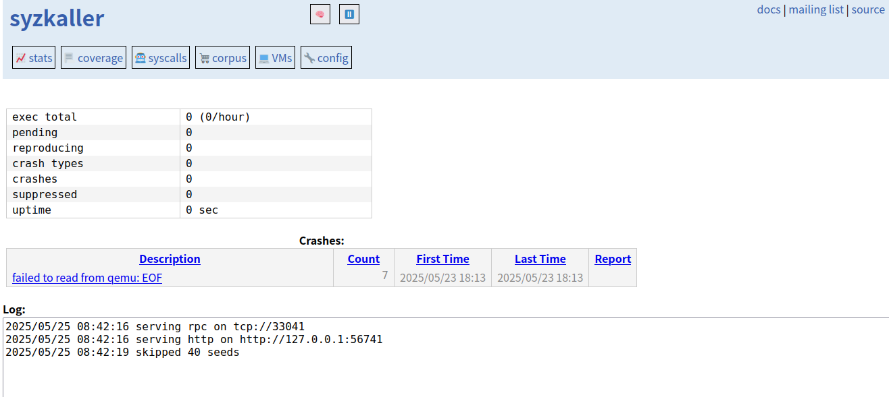

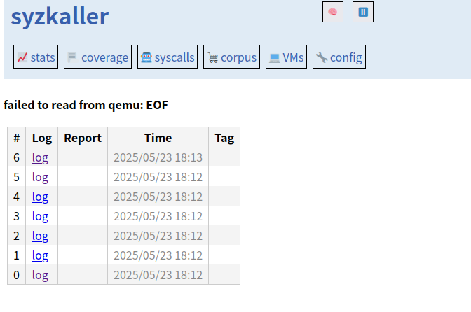

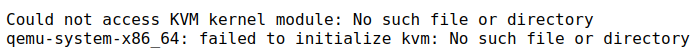

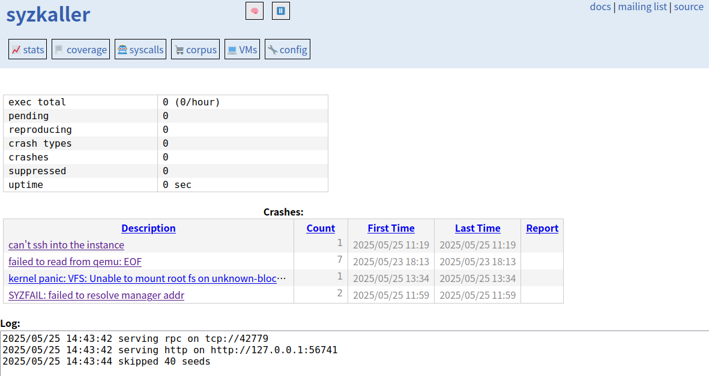

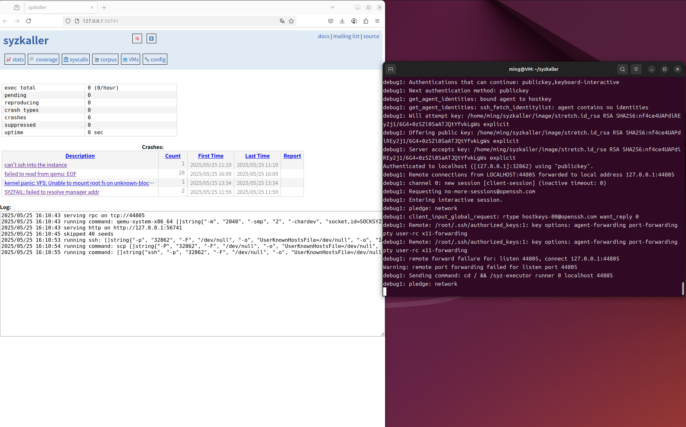

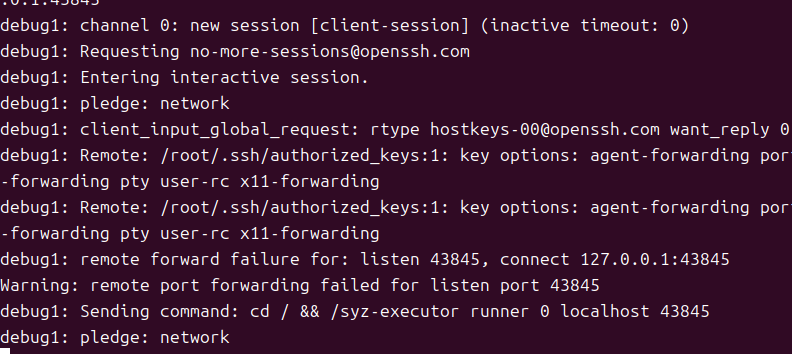


断开旧连接

sudo qemu-nbd --disconnect /dev/nbd0 || true


sudo umount /mnt/newimg
sudo qemu-nbd --disconnect /dev/nbd0


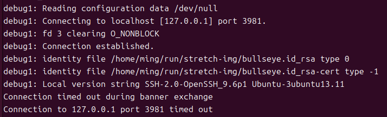


检测ssh

```python
ps aux | grep sshd
```


修改网卡

```python
sudo mkdir -p /mnt/bullseye
sudo mount -o loop /home/ming/run/stretch-img/bullseye.img /mnt/bullseye
sudo nano /mnt/bullseye/etc/network/interfaces
sudo umount /mnt/bullseye
```

